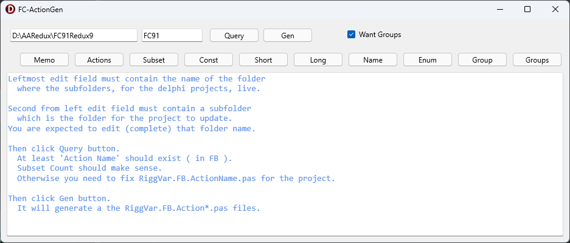

# Federgraph-ActionGen

This is just a tool to help with maintaining action definitions in Federgraph projects.



I have a family of projects. The projects sit in sibling folders. The projects differ by having a different feature blend. All projects are maintained. Think of the projects as active branches in a repo. But sometimes it is more convenient to have the branches in sibling folders, sitting next to each other.

ActionGen has the brutto of all the action definitions for these projects. It is considered the master catalog. New actions should be defined in ActionGen, and then shared with the projects that use the feature related to the action.

The most obvious use case is when you want to remove a feature.
In the example below I want to remove a feature from FC91K.
The work is done in a copy of 

The folder structure of the use case example is as follows:

```
FC
  ActionGen
  FC91K
  FC91L
```

You see, ActionGen is sitting next to the projects I want to maintain.

How to use ActionGen:

- Make sure you work with FC91L, the copy of FC91K.
- Start by removing the actions related to the feature.
Do this by editing RiggVar.FB.ActionName.pas of project FC91L.
This is the only file that should be changed, by deleting lines form it.
- Then open ActionGen. The edit field for the working directory should already be correct because ActionGen folder is located next to the project folder.
- Edit the edit field for the project name, this should be the folder name of the project. In this case FC91L.
- Then press the Query button.
- Check the output in Memo. If ok then press Gen button.
- Close ActionGen.
- Open project FC91L in Delphi IDE. Go from there.

Content of Memo after pressing Query button:

```
QueryCounter = 1

ActionShort exists.
ActionLong exists.
ActionName exists.
ActionConst exists.

SubsetCount = 516
```

Content of Memo after pressing Gen button:

```
Updating files in target location ...
ActionConst.pas written.
ActionShort.pas written.
ActionLong.pas written.
ActionName.pas written.
ActionDef.pas written.
ActionEncode.pas written.
ActionDecode.pas written.
ActionGroup.pas written.
ok
```

The written files are now *maintained*.

I did not describe the action system of Federgraph projects. I have just given a description of how to use the ActionGen project to maintain the set of used actions in Federgraph projects.
